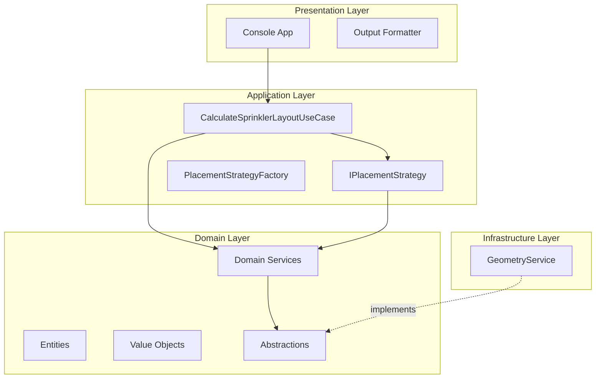
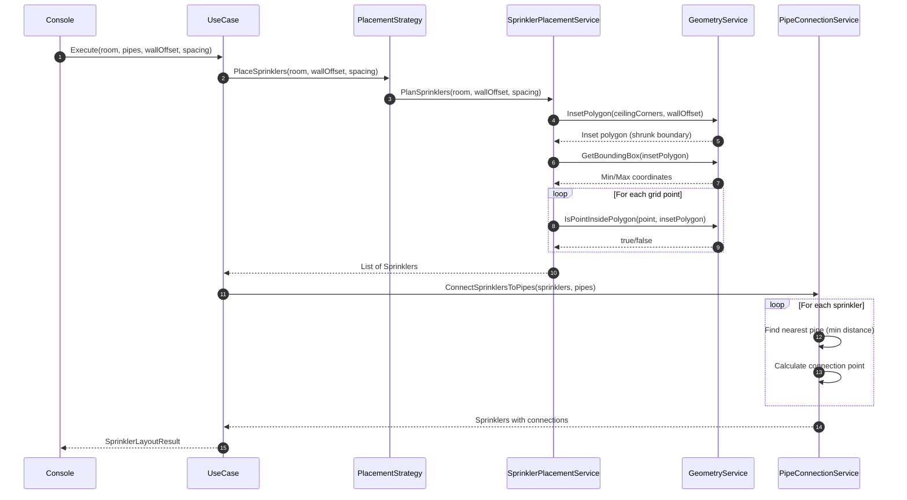

# Fire Sprinkler

[](https://dotnet.microsoft.com/)
[]()

A fire protection engineering solution that calculates optimal sprinkler placement and water pipe connections for building safety compliance.

---

## Table of Contents

- [Overview](#overview)
- [Problem Statement](#problem-statement)
- [System Design](#system-design)
  - [Architecture Overview](#architecture-overview)
  - [Solution Flow](#solution-flow)
  - [Core Algorithms](#core-algorithms)
- [Project Structure](#project-structure)
- [Getting Started](#getting-started)
- [Sample Output](#sample-output)
- [Visual Representation](#visual-representation)
- [Design Patterns](#design-patterns)
- [Testing](#testing)

---

## Overview

This application automates fire sprinkler system design by calculating:
- **Sprinkler Quantity**: Number of sprinklers required to cover a room
- **Sprinkler Positions**: Exact 3D coordinates (x, y, z) on the ceiling
- **Pipe Connections**: Optimal connection points to the nearest water supply pipe

---

## Problem Statement


---

## System Design

### Architecture Overview

The solution implements **Clean Architecture** with clear separation of concerns:



---

### Solution Flow

The system processes sprinkler layout calculations through these steps:



---

### Core Algorithms

#### 1. Polygon Inset Algorithm

Creates a safe placement boundary by shrinking the room perimeter:

```
┌─────────────────────────────────────┐
│  Original Ceiling Boundary          │
│    ┌─────────────────────────────┐  │
│    │  ← 2500mm offset            │  │
│    │    Inset Boundary           │  │
│    │      (Safe Zone)            │  │
│    │                             │  │
│    └─────────────────────────────┘  │
└─────────────────────────────────────┘
```

**Steps:**
1. Calculate edge vectors between consecutive vertices
2. Compute inward-pointing normals (perpendicular rotation)
3. Calculate bisector at each corner
4. Adjust offset distance based on corner angle
5. Validate resulting polygon has positive area

---

#### 2. Grid-Based Sprinkler Placement

Generates candidate positions using an axis-aligned grid:

```
Bounding Box (Min → Max)
┌───────────────────────────┐
│  ●     ●     ●     ●     │ ← Grid points
│     ●     ●     ●        │   at 2500mm spacing
│  ●     ●     ●     ●     │
│     ●     ●     ●        │
└───────────────────────────┘
● = Candidate position (validated via ray-casting)
```

**Algorithm:**

```
FOR x = min.X TO max.X STEP spacing
  FOR y = min.Y TO max.Y STEP spacing
    IF IsPointInsidePolygon(x, y) THEN
      ADD Sprinkler(x, y, ceilingZ)
```

---

#### 3. Point-in-Polygon Detection (Ray Casting)

Determines if a sprinkler position falls within the valid ceiling area:

```
     Ray →
─────────────────────────●────────────→
          ╱╲          ╱   ╲
         ╱  ╲   ●    ╱     ╲
        ╱    ╲      ╱       ╲
       ╱      ╲────╱         ╲

Odd intersections  = INSIDE  ✓
Even intersections = OUTSIDE ✗
```

---

#### 4. Nearest Pipe Connection

For each sprinkler, finds the optimal connection point using line-segment projection:

```
Pipe Segment:  A ────────────────── B
                        ↑
                        │ Perpendicular
                        │ projection
                        ●
                    Sprinkler
```

**Formula:**

```
t                = clamp((P - A) · (B - A) / |B - A|², 0, 1)
ConnectionPoint  = A + t × (B - A)
```

---

## Project Structure

```
FireSprinklerDesign/
├── src/
│   ├── FireSprinklerDesign.Domain/          # Core business logic
│   │   ├── Abstractions/                    # Interface contracts
│   │   │   ├── IGeometryService.cs
│   │   │   ├── IPipeConnectionService.cs
│   │   │   └── ISprinklerPlanner.cs
│   │   ├── Entities/                        # Domain entities
│   │   │   ├── Pipe.cs
│   │   │   ├── Room.cs
│   │   │   └── Sprinkler.cs
│   │   ├── Services/                        # Domain services
│   │   │   ├── PipeConnectionService.cs
│   │   │   └── SprinklerPlacementService.cs
│   │   └── ValueObjects/                    # Immutable types
│   │       ├── Point3D.cs
│   │       ├── Vector3D.cs
│   │       └── LineSegment3D.cs
│   │
│   ├── FireSprinklerDesign.Application/     # Use cases & orchestration
│   │   ├── DTOs/
│   │   ├── Strategies/                      # Placement algorithms
│   │   │   ├── IPlacementStrategy.cs
│   │   │   ├── GridPlacementStrategy.cs
│   │   │   └── PlacementStrategyFactory.cs
│   │   └── UseCases/
│   │       └── CalculateSprinklerLayoutUseCase.cs
│   │
│   ├── FireSprinklerDesign.Infrastructure/  # External implementations
│   │   └── Services/
│   │       └── GeometryService.cs           # Computational geometry
│   │
│   └── FireSprinklerDesign.Console/         # Entry point
│       ├── DependencyInjection/
│       ├── Output/
│       │   └── ConsoleOutputFormatter.cs
│       └── Program.cs
│
└── tests/
    └── FireSprinklerDesign.Tests/           # Unit & integration tests
```

---

## Getting Started

### Prerequisites

- [.NET 10 SDK](https://dotnet.microsoft.com/download)

### Build & Run

```bash
# Clone repository
git clone https://github.com/Tanvir1526/FireSprinkler.git
cd FireSprinkler

# Restore dependencies
dotnet restore

# Build solution
dotnet build

# Run application
dotnet run --project src/FireSprinklerDesign.Console
```

### Run Tests

```bash
dotnet test
```

---

## Sample Output


---

## Visual Representation

An interactive HTML visualization of the sprinkler layout is available at [`sprinkler_layout.html`](sprinkler_layout.html).

Open the file directly in any modern browser — no server or build step required.

### Preview

### 🌐 Live Layout Visualization

[Open Interactive Layout](https://tanvir1526.github.io/FireSprinkler/sprinkler_layout.html)


> **To view:** Open `sprinkler_layout.html` in a browser after cloning the repository.


---

## Design Patterns

| Pattern | Implementation | Purpose |
|---------|----------------|---------|
| **Clean Architecture** | 4-layer project structure | Separation of concerns, testability |
| **Strategy Pattern** | `IPlacementStrategy` | Interchangeable placement algorithms |
| **Factory Pattern** | `PlacementStrategyFactory` | Strategy instantiation & selection |
| **Dependency Injection** | `ServiceCollection` | Loose coupling, configurability |
| **Value Objects** | `Point3D`, `Vector3D`, `LineSegment3D` | Immutability, domain modeling |
| **Repository Pattern** | Domain abstractions | Infrastructure independence |

---

## Testing

The solution includes comprehensive unit tests covering:

- **Domain Logic**: Entity behavior, value object operations
- **Geometry Calculations**: Point-in-polygon, polygon inset, distance calculations
- **Service Layer**: Sprinkler placement, pipe connection algorithms
- **Edge Cases**: Empty rooms, sharp corners, boundary conditions

---
---

<p align="center">
  <sub>Built with precision engineering for fire safety compliance.</sub>
</p>
