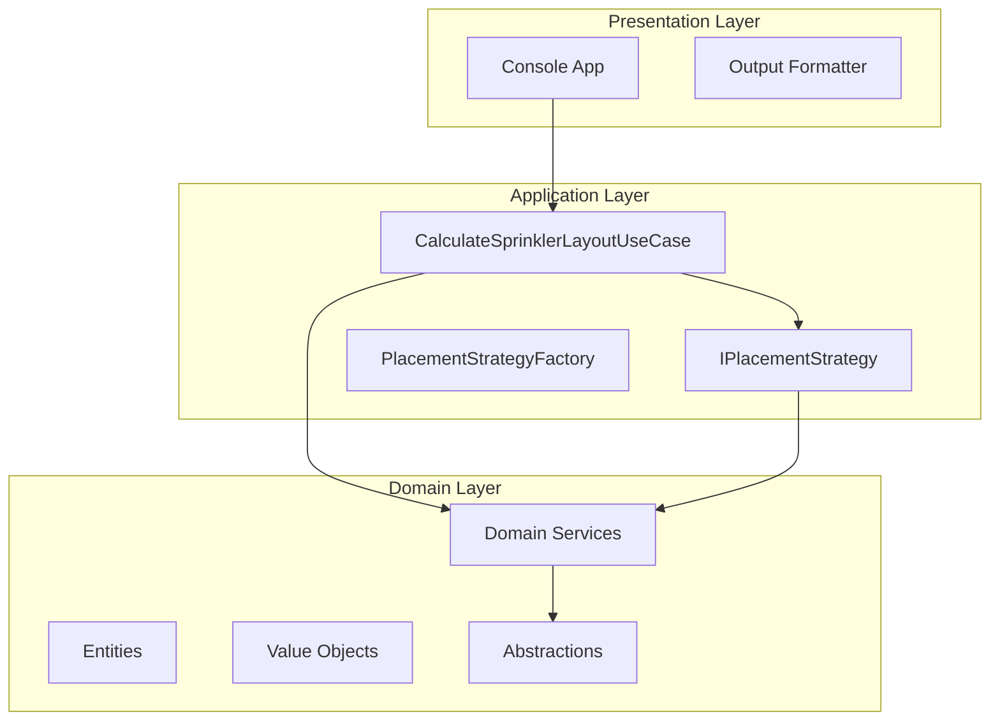
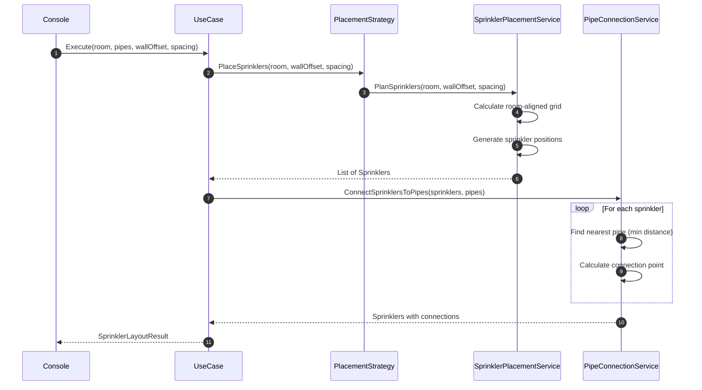

# Fire Sprinkler

[](https://dotnet.microsoft.com/)
[]()
[]()

A fire protection engineering solution that calculates optimal sprinkler placement and water pipe connections for building safety compliance.

---

## Table of Contents

- [Overview](#overview)
- [Problem Statement](#problem-statement)
- [System Design](#system-design)
  - [Architecture Overview](#architecture-overview)
  - [Solution Flow](#solution-flow)
  - [Core Algorithms](#core-algorithms)
- [Project Structure](#project-structure)
- [Getting Started](#getting-started)
- [Sample Output](#sample-output)
- [Visual Representation](#visual-representation)
- [Design Patterns](#design-patterns)
- [Testing](#testing)

---

## Overview

This application automates fire sprinkler system design by calculating:
- **Sprinkler Quantity**: Number of sprinklers required to cover a room
- **Sprinkler Positions**: Exact 3D coordinates (x, y, z) on the ceiling
- **Pipe Connections**: Optimal connection points to the nearest water supply pipe

---

## Problem Statement


---

## System Design

### Architecture Overview

The solution implements **Clean Architecture** with clear separation of concerns:



---

### Solution Flow

The system processes sprinkler layout calculations through these steps:



---

### Core Algorithms


#### 1. Grid-Based Sprinkler Placement

Generates candidate positions using a **local coordinate system** aligned with room edges, supporting both axis-aligned and rotated rooms:

```
Room-Aligned Grid (supports rotation)
┌───────────────────────────┐
│  ●     ●     ●     ●     │ ← Grid points aligned
│     ●     ●     ●        │   to room orientation
│  ●     ●     ●     ●     │   at specified spacing
│     ●     ●     ●        │
└───────────────────────────┘
● = Sprinkler position
```


```
origin    = corners[1]
edgeU     = corners[0] - corners[1]  // First edge direction
edgeV     = corners[2] - corners[1]  // Second edge direction

FOR i = 0 TO countU
  FOR j = 0 TO countV
    uDistance = wallOffset + i * spacing
    vDistance = wallOffset + j * spacing
    position  = origin + uDistance * uUnit + vDistance * vUnit
    ADD Sprinkler(position.X, position.Y, interpolatedZ)
```
---

#### 2. Nearest Pipe Connection

For each sprinkler, finds the optimal connection point using line-segment projection:

```
Pipe Segment:  A ────────────────── B
                        ↑
                        │ Perpendicular
                        │ projection
                        ●
                    Sprinkler
```

**Formula:**

```
t                = clamp((P - A) · (B - A) / |B - A|², 0, 1)
ConnectionPoint  = A + t × (B - A)
```

---

## Project Structure

```
FireSprinklerDesign/
├── src/
│   ├── FireSprinklerDesign.Domain/          # Core business logic
│   │   ├── Abstractions/                    # Interface contracts
│   │   │   ├── IPipeConnectionService.cs
│   │   │   └── ISprinklerPlanner.cs
│   │   ├── Entities/                        # Domain entities
│   │   │   ├── Pipe.cs
│   │   │   ├── Room.cs
│   │   │   └── Sprinkler.cs
│   │   ├── Services/                        # Domain services
│   │   │   ├── PipeConnectionService.cs
│   │   │   └── SprinklerPlacementService.cs # Computational geometry
│   │   └── ValueObjects/                    # Immutable types
│   │       ├── Point3D.cs
│   │       ├── Vector3D.cs
│   │       └── LineSegment3D.cs
│   │
│   ├── FireSprinklerDesign.Application/     # Use cases & orchestration
│   │   ├── DTOs/
│   │   ├── Strategies/                      # Placement algorithms
│   │   │   ├── IPlacementStrategy.cs
│   │   │   ├── GridPlacementStrategy.cs
│   │   │   └── PlacementStrategyFactory.cs
│   │   └── UseCases/
│   │       └── CalculateSprinklerLayoutUseCase.cs
│   │      
│   │
│   └── FireSprinklerDesign.Console/         # Entry point
│       ├── DependencyInjection/
│       ├── Output/
│       │   └── ConsoleOutputFormatter.cs
│       └── Program.cs
│
└── tests/
    └── FireSprinklerDesign.Tests/           # Unit & integration tests
```

---

## Getting Started

### Prerequisites

- [.NET 10 SDK](https://dotnet.microsoft.com/download)

### Build & Run

```bash
# Clone repository
git clone https://github.com/Tanvir1526/FireSprinkler.git
cd FireSprinkler

# Restore dependencies
dotnet restore

# Build solution
dotnet build

# Run application
dotnet run --project src/FireSprinklerDesign.Console
```

### Run Tests

```bash
dotnet test
```

---

## Sample Output


---

## Visual Representation

An interactive HTML visualization of the sprinkler layout is available at [`sprinkler_layout.html`](sprinkler_layout.html).

Open the file directly in any modern browser — no server or build step required.

### Preview

### 🌐 Live Layout Visualization

[Open Interactive Layout](https://tanvir1526.github.io/FireSprinkler/sprinkler_layout.html)


> **To view:** Open `sprinkler_layout.html` in a browser after cloning the repository.


---

## Design Patterns

| Pattern | Implementation | Purpose |
|---------|----------------|---------|
| **Clean Architecture** | 3-layer project structure | Separation of concerns, testability |
| **Strategy Pattern** | `IPlacementStrategy` | Interchangeable placement algorithms |
| **Factory Pattern** | `PlacementStrategyFactory` | Strategy instantiation & selection |
| **Dependency Injection** | `ServiceCollection` | Loose coupling, configurability |
| **Value Objects** | `Point3D`, `Vector3D`, `LineSegment3D` | Immutability, domain modeling |

---

## Testing

The solution includes comprehensive unit tests covering:

- **Domain Logic**: Entity behavior, value object operations
- **Service Layer**: Sprinkler placement, pipe connection algorithms
- **Edge Cases**: Empty rooms, boundary conditions

---
---

<p align="center">
  <sub>Built with precision engineering for fire safety compliance.</sub>
</p>
